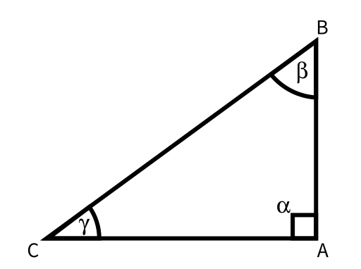

# Teoremi dei triangoli rettangoli

- $a$ ipotenusa, $b$ e $c$ cateti
- $\alpha = \frac \pi 2$ angolo retto
- $\beta$ e $\gamma$ angoli opposti rispettivamente ai lati $b$ e $c$

- **1°**: $c=a\sin \gamma$
- **2°**: $b=a\cos \gamma$
- **3°**: $c=b \tan \gamma$

# Area di un triangolo qualsiasi
In un triangolo qualsiasi, l'area è uguale al prodotto tra due lati e il seno dell'angolo compreso.

$$
\mathcal A = \frac{1}{2}ab\sin\gamma
$$

# Teorema della corda
La lunghezza di una corda di una circonferenza è uguale al prodotto tra il diametro e l'angolo alla circonferenza che insiste sulla corda.

$$
\overline{AB} = 2r\sin\alpha
$$

Si hanno casi particolari quando:
- $\overline{AB} = r\sqrt{ 3 }$: triangolo equilatero inscritto
- $\overline{AB} = r\sqrt{ 2 }$: quadrato inscritto
- $\overline{AB} = r$: esagono regolare inscritto
# Teorema dei seni
In un triangolo qualunque, vale:

$$
\frac{a}{\sin\alpha}=\frac{b}{\sin\beta}=\frac{c}{\sin\gamma}=2r
$$

Dove $r$ è il raggio della circonferenza circoscritta.

# Teorema dei coseni
In un triangolo qualunque, vale:

$$
c^2=a^2+b^2-2ab\cos \gamma
$$

